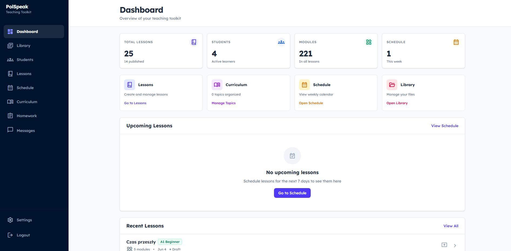
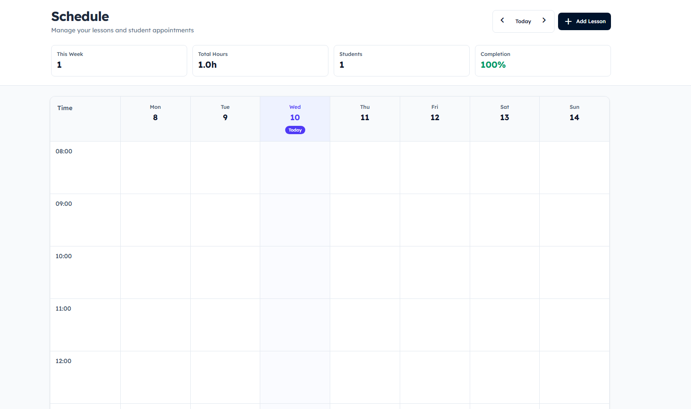
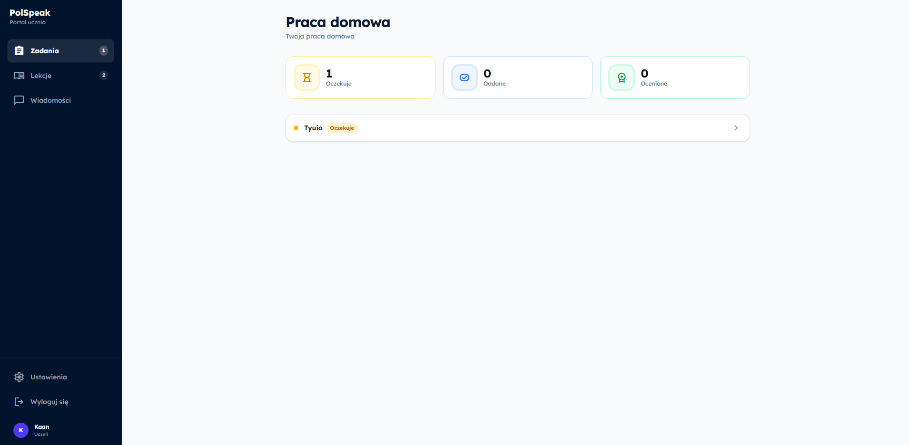
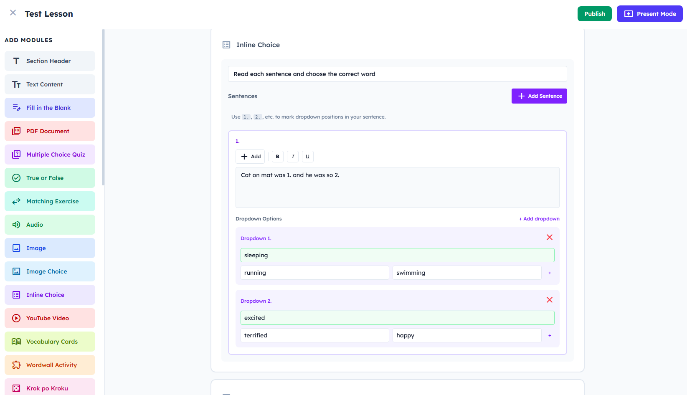
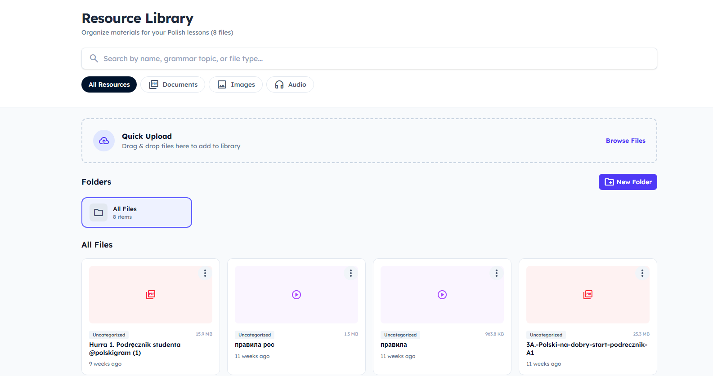

# PolSpeak

A web-based management platform for private English language tutors. Manage students, schedule lessons, create interactive lesson content, assign homework, and track curriculum progress — all in one place.



## Screenshots

| Schedule | Students |
|---|---|
|  |  |

| Lesson Editor | Library |
|---|---|
|  |  |

## Tech Stack

| Layer | Technology |
|---|---|
| Framework | Next.js 16 (App Router) |
| Language | TypeScript |
| Styling | Tailwind CSS v4 |
| Database & Auth | Supabase (PostgreSQL + Row Level Security) |
| File Storage | Cloudflare R2 (presigned URLs) |
| PWA | next-pwa (service worker, offline support) |
| Icons | lucide-react |
| Image Optimization | browser-image-compression (client-side WebP) |

## Prerequisites

- Node.js 18+
- A [Supabase](https://supabase.com) project
- A [Cloudflare R2](https://www.cloudflare.com/developer-platform/r2/) bucket (for file uploads)

## How to Build & Run

### 1. Clone and install

```bash
git clone <your-repo-url>
cd polspeak
npm install
```

### 2. Configure environment variables

Copy `.env.example` to `.env.local` and fill in your values:

```bash
cp .env.example .env.local
```

```env
# Supabase
NEXT_PUBLIC_SUPABASE_URL=https://your-project.supabase.co
NEXT_PUBLIC_SUPABASE_ANON_KEY=your-anon-key
SUPABASE_SERVICE_ROLE_KEY=your-service-role-key

# Cloudflare R2
R2_ACCOUNT_ID=your-account-id
R2_ACCESS_KEY_ID=your-r2-access-key-id
R2_SECRET_ACCESS_KEY=your-r2-secret-access-key
R2_BUCKET_NAME=your-bucket-name
R2_PUBLIC_URL=https://your-r2-public-url.example.com
NEXT_PUBLIC_R2_PUBLIC_URL=https://your-r2-public-url.example.com
```

### 3. Set up the database

Run `supabase-schema.sql` in your Supabase project's SQL Editor. This creates all required tables, indexes, triggers, and RLS policies.

### 4. Run the development server

```bash
npm run dev
```

Open [http://localhost:3000](http://localhost:3000) in your browser.

### 5. Build for production

```bash
npm run build
npm start
```

## Project Structure

```
src/
├── app/                    # Next.js App Router pages and API routes
│   ├── api/                # Server-side API endpoints (upload, homework, auth)
│   ├── dashboard/          # Teacher dashboard
│   ├── students/           # Student management (individual + groups)
│   ├── schedule/           # Lesson scheduling & calendar
│   ├── lessons/            # Lesson content editor and presenter
│   ├── library/            # File library (PDFs, audio, images)
│   ├── curriculum/         # Curriculum topic tracker (A1–C1)
│   ├── messages/           # Messaging
│   ├── settings/           # Account settings
│   ├── teacher/homework/   # Teacher homework review
│   ├── student/            # Student portal
│   └── login/              # Teacher and student login pages
├── components/             # Shared UI components
├── contexts/               # React contexts (Library, Toast)
└── lib/                    # Supabase client, helpers, image compression
```

## License

[MIT](LICENSE)
